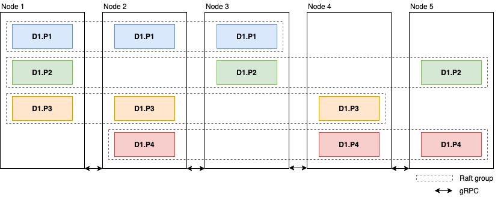
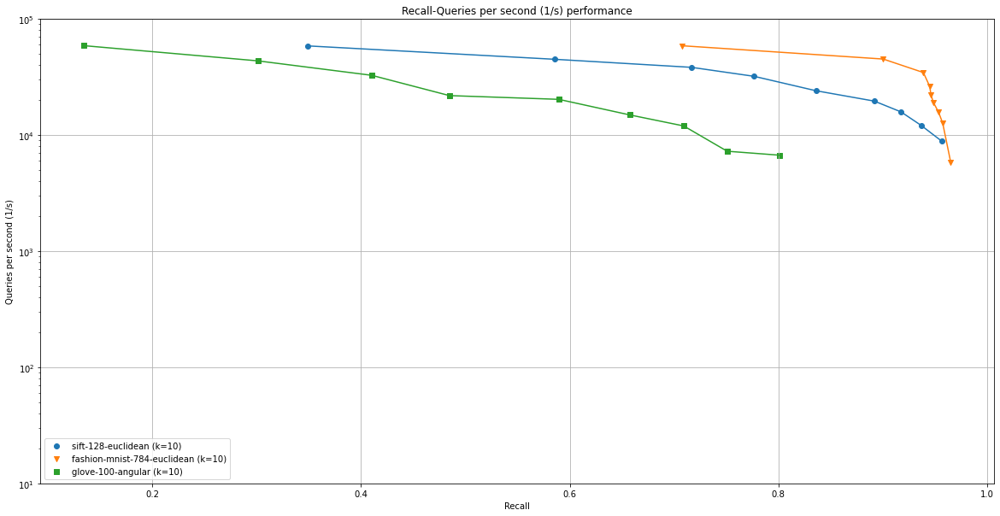

> [!WARNING]  
> **This project is no longer maintained.** If you are looking for a production-ready vector database, check out **[TopK](https://github.com/topk-io/topk)**.

# AnnDB
AnnDB is a horizontally scalable and distributed approximate nearest neighbors database. It is build from the ground up to scale to millions of high-dimensional vectors while providing low latency and high throughput.

## Install
### Install from source
```bash
git clone git@github.com:marekgalovic/anndb.git
cd anndb
make compile
```

### Install using docker
```bash
git clone git@github.com:marekgalovic/anndb.git
cd anndb
docker build -t anndb-server ./
```

## Architecture

AnnDB uses a custom implementation of HNSW [[1](https://arxiv.org/pdf/1603.09320.pdf)] to make search in high-dimensional vector spaces fast. It splits each dataset and its underlying index into partitions. Partitions are distributed and replicated across nodes in the cluster using Raft protocol [[2](https://www.cs.princeton.edu/courses/archive/fall16/cos418/papers/raft.pdf)] to ensure high availability and data durability in case of node failures. Search is performed in a map-reduce like fashion. Node that receives a search request from the client samples a node for each partition and sends partition search request to that node. Each of these nodes then searches requested partitions and aggregates results locally before sending it to the driver node which re-aggregates responses from all partitions and sends the result to the client.

## Benchmark
A scaled down version of [ANN Benchmarks](https://github.com/erikbern/ann-benchmarks). I used a GCP instance with 16 cores and 32GB RAM.


## References
- [1] [HSNW: Efficient and robust approximate nearest neighbor search using Hierarchical Navigable Small World graphs](https://arxiv.org/pdf/1603.09320.pdf)
- [2] [Raft: In Search of an Understandable Consensus Algorithm](https://www.cs.princeton.edu/courses/archive/fall16/cos418/papers/raft.pdf)
- [3] [Badger: Fast key-value DB in Go](https://github.com/dgraph-io/badger)
